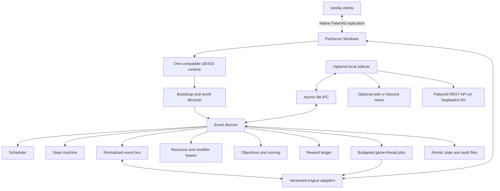
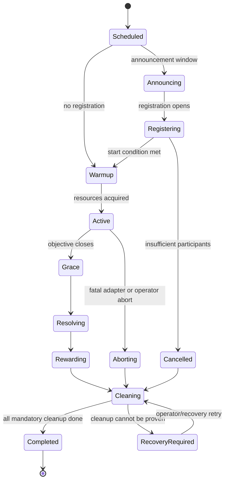

# Architecture

## Overview

Pal Event Director is a data-driven orchestration runtime around a versioned Palworld engine bridge. Generic event logic never names a Palworld class or function directly. All game interaction passes through capability adapters that validate revision, world, authority, object lifetime, rate limits, and cleanup ownership.



## Architectural decisions

1. **Server-only UE4SS Lua is the primary runtime.** It provides reflected hooks, object lookup, calls, delayed work, and fast iteration.
2. **Engine-specific code is isolated.** An adapter pack targets a tested Palworld revision and exposes stable project-level capabilities.
3. **Event definitions are data.** Production definitions cannot execute arbitrary Lua or specify arbitrary Unreal paths.
4. **The server is authoritative.** The sidecar can request operations, but only the in-process director decides and mutates gameplay state.
5. **No custom replicated content.** Optional future Blueprint/native helpers must remain server-local and cannot cross the network.
6. **Durable intent precedes mutation.** Important actions are journaled before execution and reconciled afterward.
7. **Every temporary effect has an owner and a lease.** Cleanup does not rely on remembering what a script happened to change.
8. **Every high-risk subsystem has a kill switch.** A failed adapter cannot take down unrelated event families.

## Proposed package boundaries

```text
PalEventDirector package
├── Info.json                         official package metadata
├── Scripts/
│   ├── main.lua                      minimal bootstrap
│   ├── core/                         generic orchestration
│   ├── adapters/<revision>/          Palworld-specific bridge
│   ├── events/                       built-in data definitions
│   ├── schemas/                      definition/state schema versions
│   └── vendor/                       audited pure-Lua dependencies
├── Config/
│   ├── director.json                 operator policy
│   ├── calendar.json                 enabled event instances
│   └── capabilities.json             kill switches and tested bounds
└── README.md

Writable runtime directory outside the staged package
├── state/
│   ├── snapshot.json                 compact current state
│   ├── journal.ndjson                append-only intent/result journal
│   ├── rewards.ndjson                exactly-once reward ledger
│   └── seasons/                      archived campaign state
├── ipc/
│   ├── inbox/                        optional sidecar requests
│   └── outbox/                       optional events and snapshots
├── logs/
└── quarantine/                       rejected definitions/state fragments
```

Exact installation and writable paths will be finalized after the official loader's deployed layout is tested. Package updates must not overwrite operator configuration or runtime state.

## Layer model

### Layer 1: bootstrap and lifecycle

Responsibilities:

- Print one unambiguous load record.
- Verify supported Palworld display revision and UE4SS capabilities.
- Register only stable `/Script/` hooks at initial load.
- Detect authoritative dedicated-server world readiness.
- Create one director instance per loaded game world.
- Tear down stale hooks, timers, object references, and jobs on world transition.
- Recover the journal only after the world and managers are valid.

Initialization must be idempotent. A hot reload is useful during development but a clean process launch is the release baseline.

### Layer 2: engine adapter pack

The adapter pack converts unstable Palworld surfaces into stable project interfaces. Examples:

- `messaging.announce(text)`
- `messaging.tell(player_uid, text)`
- `players.list_online()`
- `players.position(player_uid)`
- `records.snapshot(player_uid)`
- `rewards.grant_item(player_uid, item_id, count)`
- `characters.spawn(spec)`
- `characters.despawn(ownership_token)`
- `world.set_time(hour)`
- `incidents.start(kind, target)`
- `invasions.start(base_id, profile)`
- `invasions.start_all(profile, declaration_mode)`
- `invasions.start_named(group_name, target_mode, declaration_mode)`
- `signs.set_text(sign_id, text)`

Each adapter declares:

- capability name and adapter version;
- supported game/runtime fingerprint;
- evidence state;
- required manager/classes/functions;
- health probe;
- authority predicate;
- input allowlists and bounds;
- whether the call must run on the game thread;
- expected replicated outcome;
- mutation, persistence, and cleanup class;
- concurrency key;
- fallback behavior;
- diagnostic counters and last error.

An unavailable adapter returns a typed failure. It never silently guesses a replacement function.

### Layer 3: normalized event bus

Raw hooks become immutable normalized events. Generic code must not retain raw UObject wrappers.

A normalized event includes:

- unique event-record ID;
- event kind and schema version;
- server UTC and current game time;
- world/session identity;
- actor player UID, optional target UID, and resolved guild ID;
- relevant allowlisted IDs, quantities, level, location, and stage identity;
- source adapter and confidence;
- deduplication key;
- optional correlation to an active director event.

The bridge copies primitive facts on the game thread, then queues generic processing. Invalid or incomplete events are logged at bounded frequency and dropped.

### Layer 4: scheduler

The scheduler supports:

- UTC instants;
- named display timezones;
- daily/weekly/monthly recurrence;
- game-hour and day/night transitions;
- duration and phase offsets;
- manual and chat-vote starts;
- condition-based starts;
- blackout and maintenance windows;
- minimum online players and delayed starts;
- deterministic jitter within an allowed window;
- missed-run policy: skip, start-late, summarize, or reschedule;
- cooldowns and repeat suppression.

It calculates intended occurrences from durable calendar state rather than relying on a single in-memory timer. A restart therefore cannot duplicate or permanently miss a boundary.

### Layer 5: event state machine



Transitions are durable and idempotent. Each phase has:

- entry actions;
- active subscriptions;
- allowed commands;
- deadline;
- exit conditions;
- exit actions;
- retry and failure policy;
- mandatory cleanup obligations.

An event cannot enter `Active` until all mandatory resource claims and adapter probes succeed.

### Layer 6: objectives and scoring

Objectives consume normalized events or bounded state samples. Built-in operators include:

- count and weighted count;
- distinct IDs or species;
- first-to-N;
- fastest valid completion;
- longest streak;
- hold/occupy duration;
- survival time;
- ordered checkpoints;
- best single result;
- threshold and tier completion;
- team/guild aggregate;
- server-wide cooperative total;
- bracket or round winner;
- compound `all`, `any`, and staged objectives.

Scoring is deterministic. Definitions specify attribution, eligibility, ties, late joins, disconnect behavior, and whether an event record can score more than once.

Combat records preserve both the immediate source and an optional credited owner. A Pal's damage is never silently rewritten as direct player damage. The normalized record can therefore expose:

- `sourceKind`: `player`, `ownedPal`, `unownedPal`, `humanNpc`, `environment`, or `unknown`;
- `sourceActivity`: direct player, active/ridden Pal, base worker, automated structure, or other, snapshotted at hit time;
- source actor/character/instance identity where stable;
- `ownerPlayerUid` only when a validated ownership path resolves it;
- target instance identity;
- accepted damage and available attack metadata;
- death type and final-hit flag on resolution.

Per-target contribution ledgers are director-owned transient state keyed by stable target identity. They aggregate one canonical accepted-damage feed, not both incoming and outgoing delegates. A durable event checkpoint stores only bounded objective totals and any live target ledgers needed for restart policy; it does not journal every world hit indefinitely. Target death, capture, despawn, unload, healing/reset, phase transition, timeout, and event cleanup have explicit ledger finalization or discard rules.

Definitions choose credit independently for each objective: immediate actor, owning player, player-plus-all-owned-Pals, player-plus-active/ridden-Pal, team/guild aggregate, or no owner roll-up. A contribution leaderboard is a bounded reduction over this ledger, not a claim that Palworld natively publishes an MVP. Ties, minimum contribution, contributor-to-base assignment, disconnected winners, overkill clamping, and unresolved source behavior are required policy fields for competitive damage objectives.

### Layer 7: participation

Participation modes:

- forced world event affecting every technically targetable base or player;
- automatic for all eligible online players;
- explicit `!join`/`!leave`;
- guild enrollment;
- randomized draft from consenting players;
- staff-created teams;
- proximity/zone opt-in;
- activity-based implicit participation;
- solo attempt instances;
- server-wide cooperative participation.

Player UID is the stable identity. Display name is a presentation field. Guild membership is snapshotted or evaluated according to the template's declared policy so mid-event guild switching cannot create ambiguous scores.

Participation mode is separate from invasion targeting. A mandatory base siege does not enroll a base or ask its guild for permission; it creates a score subject when the native manager reports that base's incident. Technical inability to create an incident is recorded as a base outcome.

### Layer 8: action executor and game-thread queue

All UObject access and game mutations execute through a bounded game-thread queue. Async workers may parse files, evaluate pure data, or prepare messages, but they never retain or dereference game objects.

Jobs have:

- priority: cleanup, safety, reward, event-critical, normal, cosmetic;
- deadline and maximum attempts;
- capability and event owner;
- deduplication key;
- expected precondition;
- execution time measurement;
- typed result and reconciliation step.

Cleanup and safety work preempts spectacle. Per-frame work is prohibited; the queue processes a bounded number of jobs and time budget per cycle.

### Layer 9: resource claims

Events declare every shared resource they may mutate:

- world clock;
- named game setting;
- invasion system;
- supply incident system;
- a base or zone;
- arena/boss/dungeon capacity;
- signboard;
- player movement/input;
- spawn budget;
- announcement channel budget.

A claim can be exclusive, shared-read, additive, minimum, maximum, or priority override. The claim manager rejects incompatible overlap before activation.

## Modifier leases

Temporary modifiers are transactions rather than direct assignments.

A lease contains:

- resource key;
- event owner and priority;
- requested operation and bounded value;
- captured baseline and provenance;
- effective composed value;
- acquisition and expiry times;
- apply and verify records;
- revert and verify records;
- crash-recovery policy.

Examples:

- Two events request `ExpRate × 2` and `ExpRate × 1.5`: an operator policy decides multiplication, highest-wins, or conflict rejection.
- An event fixes time at night while another schedules sunrise: the exclusive world-clock claim prevents overlap.
- A crash occurs after apply but before recording success: startup reconciliation reads actual state and either adopts or reverts according to the journal.

Only allowlisted setting adapters can issue leases. Definitions cannot name arbitrary properties.

## Spawn ownership and cleanup

Every spawned actor is associated with a director ownership token containing:

- event and wave ID;
- Palworld handle/instance identity;
- species/NPC ID and requested level;
- spawn location and time;
- expiry policy;
- captured/dead/despawned/unloaded state;
- last successful reconciliation.

Rules:

1. Never identify owned actors by species or proximity alone.
2. Never despawn an actor after it has legitimately transferred to player ownership.
3. Enforce global, event, wave, zone, and per-player caps.
4. Stop spawning before server health reaches a critical threshold.
5. Use bounded reconciliation to classify alive, dead, captured, unloaded, or orphaned actors.
6. An event definition must state what happens to survivors.
7. Unknown ownership fails safe: stop spawning and do not destroy the actor.

## Reward ledger

Reward delivery follows an outbox pattern:

1. Resolve winners and calculate a canonical reward list.
2. Persist a reward obligation with a unique key derived from occurrence, reward-definition ID, recipient player, optional base/incident identity, rank/tier, and reward index.
3. Check eligibility, allowlist, quantity cap, and prior delivery.
4. Queue a game-thread grant.
5. Verify the result where the game API permits.
6. Record delivered, pending, rejected, or operator-review state.
7. Retry pending online delivery with bounded backoff.

No code path grants a reward before its obligation is durable. Replaying the journal therefore cannot grant twice.

Full inventory policy is configurable per reward type:

- retry on next login;
- split into valid stack sizes;
- substitute an allowlisted fallback;
- mark for operator review;
- never drop valuable rewards into the world unless explicitly designed and tested.

## Zone service

Zones are server-side geometry definitions using circles, spheres, boxes, or ordered checkpoint radii. They use authoritative player positions and do not create client-visible boundaries.

Guardrails:

- position sampling is batched at a moderate interval;
- only zones claimed by an active event are evaluated;
- entry/exit uses hysteresis to prevent boundary chatter;
- teleport and stage transitions reset impossible velocity samples;
- vertical bounds are explicit;
- players receive landmark/coordinate/sign instructions because no custom marker exists;
- anti-cheat decisions are not made solely from event sampling.

## Signboard service

The director never spawns a build object. Operators place vanilla signboards through normal gameplay and register their persistent identity plus intended purpose.

A sign lease:

- captures the existing text;
- verifies the allowlisted sign and optional owner/location;
- writes sanitized text through the validated sign model path;
- periodically reconciles only while leased;
- restores prior text on release when configured;
- does not claim or alter ownership automatically.

## Commands and authorization

Planned player commands:

- `!event` — active/upcoming event summary.
- `!join` and `!leave` — participation.
- `!score` — personal or guild progress.
- `!leaderboard` — bounded top entries.
- `!objectives` — concise objective text.
- `!claim` — retry an eligible pending reward where enabled.
- `!vote` — community-choice ballot.
- `!help` — command help.

Planned operator commands:

- `!ped status`
- `!ped validate <template>`
- `!ped preview <template>`
- `!ped start <template> [parameters]`
- `!ped pause|resume|abort <occurrence>`
- `!ped capability <name> on|off|probe`
- `!ped cleanup <occurrence>`
- `!ped rewards pending`

Administrative authority must derive from a configured UID allowlist and/or validated Palworld admin state. Display names are never authorization identities. Commands are parsed with strict token/length limits and sensitive values are never accepted through chat.

## Persistence model

### Snapshot

A compact, checksummed representation of active occurrences, calendar cursor, claims, spawn ownership, score aggregates, pending rewards, and adapter health.

### Journal

Append-only newline-delimited records for state transition intent/result, lease operations, action attempts, cleanup, reward obligations, and operator commands. Each record has a monotonic sequence, schema version, timestamp, and checksum or chained digest.

### Write strategy

- Write temporary file.
- Flush and close.
- Atomically rename into place.
- Retain the last known-good snapshot.
- Never truncate the journal until a verified snapshot checkpoint exists.
- Quarantine malformed files and start in recovery mode rather than silently resetting active obligations.

### Schema migration

Migrations are pure, versioned, backup-first transformations. A release refuses to start events if it cannot migrate state safely, while messaging and diagnostics may remain available.

## Restart recovery

Startup reconciliation proceeds in this order:

1. Validate package/runtime/revision.
2. Load and validate configuration.
3. Load last good snapshot and replay journal.
4. Wait for authoritative world readiness.
5. Probe mandatory adapters.
6. Reconcile modifier leases against actual values.
7. Reconcile director-owned spawn handles.
8. Restore subscriptions for active phases.
9. Resume, resolve, abort, or skip each occurrence according to its downtime policy.
10. Retry pending cleanup before starting new conflicting events.
11. Retry eligible pending rewards after player identity is available.

A dirty unresolved exclusive lease blocks events that need the same resource.

## Optional sidecar

The sidecar is a separate, least-privilege local process. Potential responsibilities:

- visual calendar/template editor;
- schema validation and dry-run simulation;
- Discord announcements and web leaderboards;
- archival analytics;
- official REST API operations such as health, announce, save, and graceful restart;
- release/deployment assistance.

Communication uses append-only or atomic-renamed files in dedicated inbox/outbox directories. Requests include nonce, timestamp, schema version, action allowlist, and optional HMAC stored outside the repository. The in-process mod validates and authorizes every request.

Palworld's REST API remains bound to loopback or a protected LAN. It is never exposed directly to the Internet.

## Observability

Structured records include:

- boot/runtime/revision identity;
- adapter probe results;
- event state transitions;
- schedule decisions and skipped runs;
- subscription counts and dropped duplicates;
- action latency, retries, and failures;
- game-thread queue depth and execution budget;
- spawn counts and reconciliation state;
- reward obligation/delivery state;
- resource claims and lease values;
- server FPS/frame time/entity counts;
- sanitized operator actions.

High-frequency errors are aggregated. Logs must not contain passwords, tokens, personal filesystem paths intended for publication, or complete sensitive platform identifiers.

## Failure isolation

| Failure | Required response |
|---|---|
| Unsupported game/runtime revision | No gameplay adapters activate; diagnostics remain available. |
| One missing hook/function | Disable that capability and dependent templates only. |
| Invalid template | Quarantine it; do not stop unrelated events. |
| Game-thread backlog | Shed cosmetic/status updates, pause spawning, preserve cleanup/rewards. |
| Server health critical | Stop new waves, resolve or abort according to template, retain ownership registry. |
| Sidecar offline | Continue core events; queue bounded outbound records. |
| State corruption | Load last good checkpoint, replay valid journal prefix, enter recovery-required mode. |
| Reward uncertainty | Do not grant again automatically; mark operator review unless verification proves absence. |
| Cleanup uncertainty | Block conflicting resources and retry/reconcile; never destroy unknown actors. |

## Extension model

A new event generally adds data only. A new primitive requires:

1. capability proposal;
2. current-header/runtime discovery;
3. observation-only spike;
4. versioned adapter;
5. test fixture and failure injection;
6. vanilla-client and cross-play evidence;
7. bounds and kill switch;
8. documentation update.

This separation is what allows the catalog to stretch Palworld's systems without turning every ambitious event into a new unreviewed code path.
