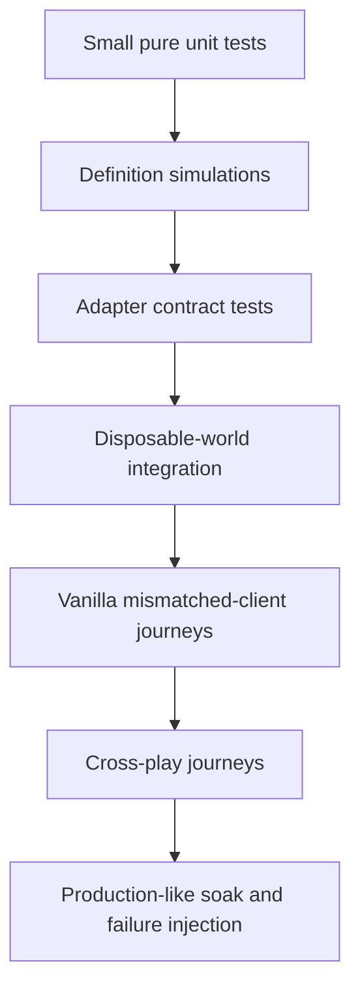

# Safety and testing

## Safety objective

An event platform is successful only if it can stop. Every feature must have bounded work, attributable state, deterministic recovery, and a tested path back to an ordinary playable world.

Pocketpair warns that mods can crash the game, corrupt or lose save data, and leave effects after removal. This project therefore treats server availability, world integrity, vanilla-client compatibility, and reward correctness as release requirements rather than operational afterthoughts.

## Risk classes

| Class | Description | Examples | Minimum gate |
|---|---|---|---|
| S0 — observation only | Reads bounded state or receives hooks; no game mutation | chat, roster, time, record snapshots | dedicated-server observation and load test |
| S1 — transient presentation | Native messages/sign leases with no progression effect | announcements, private chat, event board | vanilla-client and rate-limit tests |
| S2 — bounded progression | Adds existing rewards through normal server paths | items, XP, points | exactly-once, full inventory, save/reconnect/removal |
| S3 — reversible world mutation | Temporary time/setting/status/teleport effect | rate lease, fixed night, opt-in teleport | baseline capture, crash recovery, prediction/UI tests |
| S4 — owned actor/system lifecycle | Starts incidents/invasions or spawns actors | meteor, waves, base siege | ownership, concurrency, cleanup, health soak |
| S5 — persistent/high-impact system | Alters instance/reset/randomizer or broad world behavior | directed raid, arena rooms, randomizer weekend | isolated world, complete lifecycle, restore rehearsal, explicit enablement |
| X — forbidden | Unknown client content or unbounded/destructive behavior | custom replicated boss, arbitrary build spawn | never enabled |

An event inherits the highest risk class of its mandatory actions.

## Global safety invariants

1. No arbitrary Unreal paths or calls from configuration or chat.
2. No UObject access outside the game thread.
3. No retained wrapper is trusted without immediate validity/world checks.
4. No event starts without its mandatory adapter probes and resource claims.
5. No mutation starts without a cleanup/recovery definition.
6. No reward is granted before a durable unique obligation exists.
7. No actor is despawned without a director ownership token.
8. No unknown Pal/item/NPC/incident/modifier ID reaches a game API.
9. No high-frequency hook performs file I/O, global scans, or unbounded logging.
10. No unsupported game/runtime revision runs gameplay adapters.
11. No custom replicated class, asset, data identity, or protocol reaches a client.
12. No automatic destructive action is taken when identity, ownership, location, or state is uncertain.

## Proposed performance budgets

Initial budgets are conservative and will be replaced by measured limits.

| Budget | Initial ceiling | Response when exceeded |
|---|---:|---|
| Generic scheduler tick | once per second | Skip noncritical presentation work. |
| Zone sampling | once per second for active participants | Increase interval or pause zone events. |
| Broad object reconciliation | no more than once per 5 seconds and only active classes | Stop the dependent adapter. |
| Game-thread jobs | 4 normal jobs per cycle plus safety priority | Carry over; never burst unbounded work. |
| One normal job | target under 0.5 ms; hard warning at 2 ms | Disable or reduce adapter workload. |
| Director game-thread total | target under 2 ms per second at normal load | Shed optional work and spawns. |
| Public announcements | at most 1 per minute per event, with global burst cap | Coalesce and delay. |
| Private responses | per-player token bucket | Return one cooldown notice, then suppress. |
| Alive spawned event actors | template cap under global cap; initial global cap 20 | Stop new spawning and reconcile. |
| Total spawned per occurrence | initial global cap 100 | End wave/event according to policy. |
| Simultaneous invasions | one in laboratory; all registered bases after staged scale proof | Treat all-base siege as one exclusive occurrence; reduce per-base composition before omitting targets. |
| Simultaneous supply incidents | initial cap 1 | Queue or reject conflicts. |
| State checkpoint | at phase changes and bounded periodic interval | Pause new mutations if storage is unhealthy. |
| Journal/reward outbox | hard size/age alarms | Pause starts; preserve cleanup and delivery. |

Server-health policies use both FPS/frame time and director backlog. A single transient low-FPS sample does not abort an event; hysteresis and sustained thresholds prevent oscillation.

Priority order under pressure:

1. restore/revert and ownership reconciliation;
2. prevent duplicate rewards;
3. retain durable state;
4. critical event transitions;
5. scoring;
6. private status;
7. public progress updates;
8. spectacle/new spawns.

## Test environments

### Unit/simulation environment

No Palworld process. Test pure scheduling, state transitions, definitions, scoring, reward keys, resource conflicts, journal replay, migrations, and failure policies with deterministic clocks/seeds.

### Capability laboratory

A local isolated Windows PalServer, one compatible UE4SS runtime, a disposable world, fresh logs, and a modded test client only when Live View/dumps are required for discovery. Mutations begin only after observation.

### Vanilla integration environment

A clean Windows dedicated server plus a clean Steam client with no mod files. Run the packaged artifact through the official loader.

### Cross-play canary

At least one locked-down vanilla client, preferably Xbox or PlayStation, plus Steam. Claims list exact tested platforms.

### Production-like soak environment

A restored copy of a representative world with realistic bases, entities, guilds, and player count. Never use the sole live world copy.

## Test pyramid

A higher layer never replaces a lower layer. Passing simulation says nothing about whether a reflected call is safe.

## Generic core test suites

### Scheduler

- DST gap and repeated-hour policies.
- Leap day, month boundary, timezone change, and clock correction.
- Restart before, at, and after every occurrence boundary.
- Empty-server delay and cancellation.
- Missed occurrence policies.
- Deterministic jitter and seed replay.
- Calendar update while old occurrence is active.
- Blackout and maintenance conflicts.

### State machine

- Every legal and illegal transition.
- Duplicate transition intent/result records.
- Crash between intent and mutation/result.
- Pause/resume/abort from each phase.
- Required versus optional action failure.
- Cleanup timeout and recovery-required blocking.

### Scoring

- Duplicate raw signals.
- Reordered/delayed signals.
- Late join, reconnect, leave, death, guild change.
- Equal scores and every tie rule.
- Caps, streak reset, distinct identity, stage locks.
- Reward-generated actions excluded from scoring.
- Bracket replay with the same seed.

### Reward ledger

- Crash before grant, during grant, after grant, before result record.
- Full/partial inventory.
- Invalid and removed item IDs.
- Offline recipient and next-login retry.
- Duplicate event resolution.
- Package downgrade/restore timeline.
- Quantity/stack/value policy ceilings.

### Resource claims/modifiers

- Compatible and incompatible overlaps.
- Priority and composition policy.
- Captured baseline changed by an operator.
- Crash after apply and before verification.
- Failed revert.
- Unsupported actual value.
- Event update while lease is active.

## Adapter contract template

Every adapter test report answers:

1. Which exact game and UE4SS revisions were used?
2. Which object/function/property/delegate paths were observed?
3. When are they loaded and unloaded?
4. What thread invokes the callback?
5. How often and how many times per logical action?
6. Which object has server authority and network ownership?
7. What are every parameter and return semantics?
8. What happens with invalid, stale, cross-world, and default objects?
9. What does a vanilla client see?
10. What does a reconnecting client see?
11. What is saved and what survives restart/removal?
12. What identifies the mutation for cleanup?
13. What load and failure bounds were tested?
14. What kill switch and health probe disable it?

Generated headers are discovery inputs. Runtime observation and multiplayer tests answer these questions.

## Vanilla-client matrix

Run representative S1–S5 events across:

| Dimension | Cases |
|---|---|
| Client | Clean Steam; each claimed console/Mac platform |
| Join time | Before announcement; registration; active; resolution; cleanup; after completion |
| Connection | Stable; disconnect/reconnect; timeout; host/server restart |
| Player state | New character; established character; dead/respawning; in base; in dungeon/instance |
| Group | No guild; guild member; guild leader; guild switch attempt |
| Inventory | Empty; near full; full; stack edge; overweight |
| World | New disposable; copied mature world; many bases/entities |
| Event result | Success; timeout; insufficient players; operator abort; adapter failure; health abort |
| Mod state | Normal; project disabled after cleanup; `-NoMods` copied-world boot |

Acceptance checks include connection success, no missing-class/asset errors, correct messages/state, no crash/desync, correct reconnect view, and no residual client requirement.

## Capability-specific tests

### Messaging/chat

- Unicode and every supported language input boundary.
- Maximum safe length and rapid updates.
- Rich-text/control-character stripping.
- Public/private recipient correctness.
- Chat categories, command visibility, and rate limiting.

### Capture/kill attribution

- Player attack, owned Pal attack, other player, guild member, environment, fall, status damage.
- Capture by normal sphere, critical capture, failure, recapture-like paths if any.
- Wild, field boss, dungeon, raid, director-owned, and unrelated targets.
- One logical action creates one normalized event.
- Compare global incoming damage/death notifications with player/Pal outgoing inflict/defeat delegates and prove which single feed is canonical; never count both.
- Record callback order for nonlethal and lethal hits: accepted damage, outgoing inflict, dead/down, outgoing defeat, complete player death, loot, and despawn.
- Establish `FPalDamageResult.Damage` versus `ActualDamage` for shield absorption, overkill, zero/blocked damage, immortality, phase locks, redirected body parts, and `bCannotKill`.
- Validate final-hit attribution from `FPalDeadInfo.LastAttacker` for every `EPalDeadType`, including attack, self-destruction, temperature, falling, poison, burn, drowning, tower battle, ground, and suicide. Never reuse a stale attacker for an environmental death.
- Test direct players, active Pals, ridden Pals, partner skills, base workers, weapons, projectiles, explosions, transferred Pals, NPC companions, and owner disconnect/transfer.
- Verify whether player down and completed death emit distinct callbacks and choose one declared scoring boundary.
- Reconcile native `DamageMap` against the director ledger for HP, shield, overkill, DoT, healing, target reset, capture, unload, death, and respawn; document its reset and ownership semantics before any use.
- For most-damage objectives, test ties, minimum contribution, disconnected contributors, target healing/reset, multiple phases/forms, and bounded memory under sustained combat.

### Item/crafting/gathering

- Natural gather versus chest transfer, drop/pickup, craft output, base production, trade, and director reward.
- Stack split and full container/inventory.
- Cancelled work and repeated callbacks.
- Existing IDs removed or changed after game update.

### Position/teleport

- Mount, glider, fall, death, respawn, fast travel, dungeon/arena travel, reconnect.
- Floor/water/restricted-volume validation.
- Recovery origin and failed destination.
- Zone boundary hysteresis and vertical overlap.
- No automated punishment based on sampling anomalies.

### Character spawn/despawn

- Every approved species/profile and boundary level.
- Multiple vanilla clients observing spawn, combat, death, capture, unload, and reconnect.
- Server restart with live owned actors.
- Captured actor never despawned as server-owned.
- Expired actor unloaded by world partition.
- Spawn failure and callback absence.
- Global entity/FPS threshold response.

### Incident/invasion

- Native preconditions and concurrent-system limits.
- Declaration/start/arrival/wave/end/timeout/cancel.
- `StartInvaderMarchAll()` coverage across every registered base observer.
- Exact stock `GroupName` selection and the scope difference between generic and nearest-base debug calls.
- `bSkipInvaderDeclaration=true`, including whether it bypasses the Negotiator and starts a forced assault.
- Target base removed, unloaded, obstructed, on cooldown, already invaded, or without online owners.
- Incident completes while area unloaded.
- Restart mid-incident.
- No cleanup call affects a naturally occurring incident.

### Bounty invasions

- Transform native selected members before character initialization, never after their drop/combat state is fixed.
- Log target base ID, assigned-Work-Pal snapshot summary, native invasion grade, selected stock row, wave, native member level, level-policy revision, and effective member level.
- Under `native`, verify each substituted bounty retains the exact final level selected for the member it replaces.
- Under `fixed`, verify minimum, maximum, invalid, and current game-level-cap behavior; reject rather than wrap, truncate, or silently exceed policy.
- Under `relative`, verify positive and negative offsets, clamping, every wave, and no compounding when a hook is invoked more than once.
- Under `workerDerived`, verify the named statistic against controlled level distributions, empty/partly filled bases, duplicate levels, workers added or removed during declaration, and restart recovery.
- Create at least two bases in the same guild with materially different assigned Work-Pal levels and prove that native grades/final levels are evaluated per target base rather than copied guild-wide.
- Determine the current native Work-Pal aggregation observationally; do not infer maximum, average, or exact worker-to-attacker equality from the official scaling statement.
- Test a low-, middle-, and high-yield `BOSS_*` character ID.
- Verify model, localized name, AI, weapon, companion Pal, level, and replication on a clean client.
- Verify current `BountyProof_1` quantity on defeat and capture.
- Verify captured bounty actors leave the native invasion group so waves complete.
- Verify later butchering produces or does not produce the documented second drop, and account for it in the economy preview.
- Verify the stock invasion completion reward remains separate from actor drops.
- Verify the original overworld bounty marker, respawn timer, first-clear reward, and save state remain unchanged.
- Test token upper bounds at the actual base count, wave count, actor count, and relevant drop-rate settings.

### Signboards

- Staff allowlist identity survives restart.
- Word filtering and all claimed client platforms.
- Concurrent player edit.
- Sign destruction/rebuild and identity mismatch.
- Prior text restoration and lease conflict.

### Modifiers

Test one setting/property per capability report. Include baseline, every bounded value, client UI, active objects/tasks, new objects/tasks, reconnect, restart, crash recovery, external operator edit, and revert verification.

## Failure injection

Required injected faults:

- Throw/error in each adapter before and after mutation.
- Return invalid object or typed API failure.
- Remove target actor between scheduling and game-thread execution.
- Duplicate hooks or callbacks.
- Delay callback past phase deadline.
- Deny/lock state directory and fill disk.
- Corrupt final journal line, snapshot, definition, or sidecar request.
- Kill server process at every transaction boundary on a disposable world.
- Drop sidecar during request/result.
- Force sustained poor FPS/backlog.
- Change game revision/fingerprint.
- Deploy duplicate UE4SS runtime in laboratory to prove diagnostics detect it; never in production.

## Save and persistence testing

Classify each event as:

- `none` — observation/presentation only;
- `directorOnly` — only external project state;
- `transientWorld` — intended to disappear/revert;
- `progressionAdditive` — normal permanent rewards/records;
- `worldPersistent` — affects Palworld world state;
- `highImpact` — randomizer/reset/instance or broad save behavior.

For S2+, test:

- fresh world;
- copied existing world;
- save/exit/reload;
- graceful restart;
- abrupt process termination;
- package disable and removal;
- dependency removal;
- rollback to prior project release;
- copied world boot with all mods disabled.

Never claim “safe to uninstall” when rewards or normal captured/spawned outcomes intentionally remain.

## Security model

### Trust boundaries

- Player chat is untrusted.
- Event template/config imports are untrusted.
- Sidecar inbox is untrusted until authenticated and authorized.
- Reflected game data is version-sensitive and may be malformed/unavailable during teardown.
- Third-party runtimes and dependencies are supply-chain inputs.

### Controls

- Strict command grammar, input length, token count, rate limit, and allowlists.
- UID-based authorization; no display-name authorization.
- No secrets accepted in chat or committed to the repository.
- Canonical path checks and atomic dedicated state directories.
- No arbitrary commands, scripts, module loads, paths, or adapters in templates.
- Sidecar least privilege, loopback binding, request nonce/timestamp, optional HMAC.
- Official REST API never Internet-exposed.
- Dependency hashes, source provenance, and release artifact audit.
- Logs sanitize control characters and sensitive identifiers.

## Abuse and fairness testing

Red-team each template for:

- reconnect/login spam;
- item drop/pickup and container-transfer loops;
- craft/cancel/dismantle loops;
- farming director-owned actors;
- guild hopping;
- alt accounts and collusion;
- chat/vote flooding;
- route teleport/skips;
- AFK occupancy;
- reward feedback loops;
- event overlap amplification;
- clock manipulation;
- operator intervention mid-event.

Not every exploit needs prevention. Rules may cap its value, exclude the signal, or flag staff review, but behavior must be explicit.

## Release gates

### Definition gate

- Schema valid and canonical.
- Required capabilities released for current revision.
- Claims, budgets, recovery, cleanup, and rewards complete.
- Simulation passes all phase/restart/failure paths.
- Player text accurately describes actual behavior.

### Adapter gate

- Observation and invocation evidence recorded.
- Authority and object-lifetime checks implemented.
- Vanilla Steam and claimed cross-play journeys pass.
- Persistence/removal and cleanup understood.
- Performance/soak within budget.
- Kill switch verified.

### Package gate

- Official `Info.json` and server rule valid.
- Exact dependencies declared.
- Clean install/update/disable/removal tested.
- No source-only files, caches, dumps, logs, personal paths, or secrets.
- Version/revision/hash evidence retained.

### Production gate

- Repository revision committed and pushed.
- Package traceable to that revision.
- Current remote/local canonical revision matches.
- Verified backups and rollback artifact exist.
- Final vanilla-client journey passed after all integration changes.
- No unclassified dirty production inputs.
- Deployment explicitly authorized for that task.

## Stop-ship conditions

- Any vanilla client requires local files or reports unknown content.
- Duplicate or lost reward cannot be distinguished safely.
- Cleanup can affect unrelated actors/incidents/state.
- Unsupported revision runs by default.
- Game-thread work is unbounded or causes material server degradation.
- A setting cannot be restored after crash.
- Client prediction/UI discrepancy materially misleads gameplay.
- Save/reconnect/removal behavior is unknown.
- Required backup/rollback or provenance evidence is missing.
